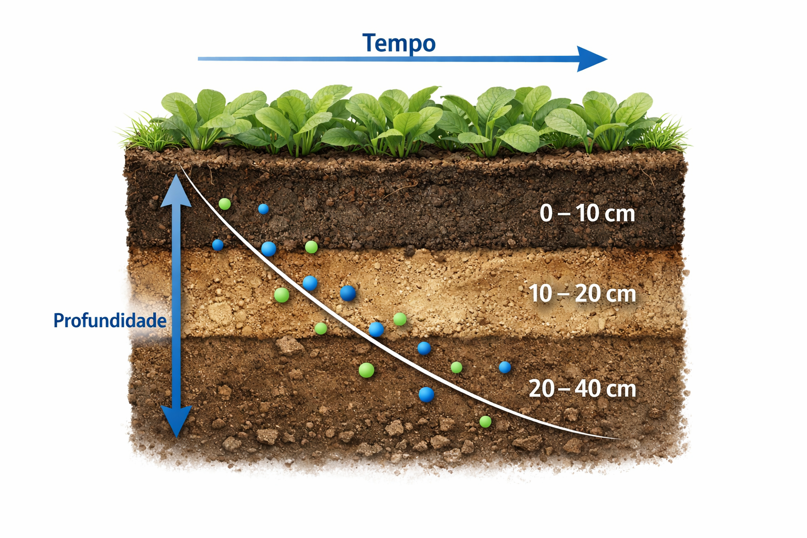
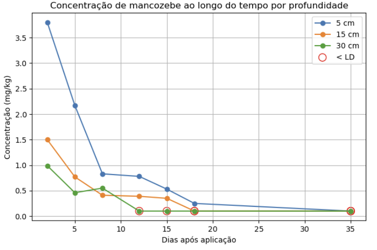
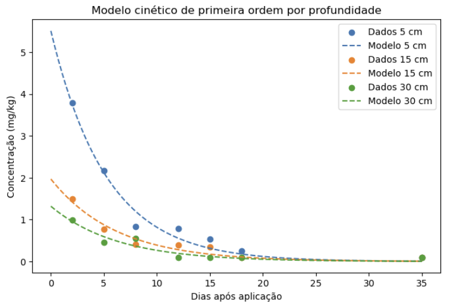
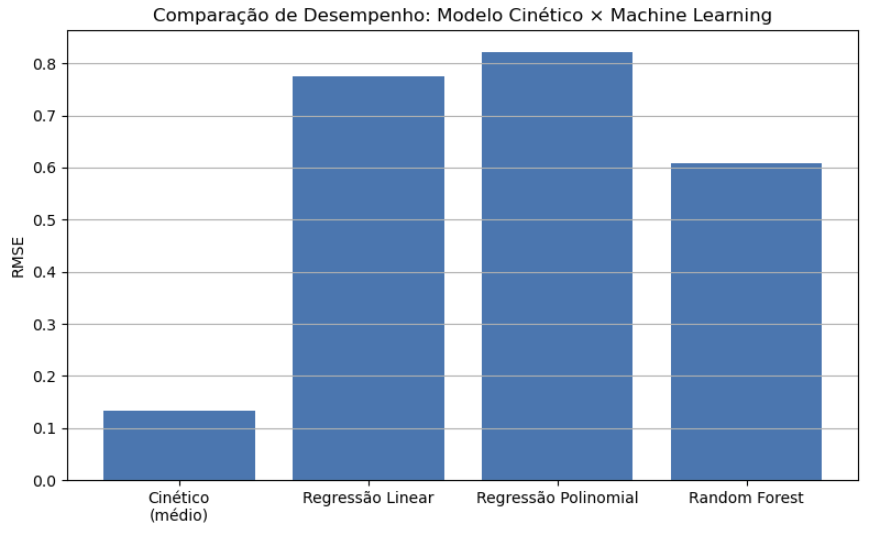
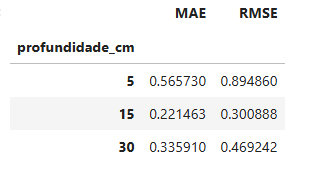

# Monitoramento de Pesticida em Solo Agrícola

  

# Introdução

A modelagem de processos ambientais frequentemente utiliza modelos cinéticos baseados em princípios físico-químicos para descrever fenômenos de degradação e persistência de contaminantes no ambiente. Embora esses modelos sejam amplamente aceitos e interpretáveis, eles podem apresentar limitações ao lidar com sistemas complexos influenciados por múltiplas variáveis ambientais.

Com o avanço das técnicas de Machine Learning (ML), surge a possibilidade de utilizar modelos orientados por dados para complementar ou comparar o desempenho de modelos tradicionais. Neste contexto, este projeto investiga a aplicação de modelos de ML para prever o comportamento do fungicida mancozebe, comparando seus resultados com um modelo cinético clássico.

# Objetivo
O objetivo principal deste projeto é:
Comparar o desempenho de um modelo cinético tradicional com modelos de Machine Learning na predição da variável alvo relacionada à degradação do mancozebe, avaliando se os modelos de ML são capazes de representar ou superar a abordagem cinética.

# Dataset
O dataset utilizado neste estudo é composto por dados experimentais relacionados à degradação do mancozebe, incluindo:

- Variáveis experimentais do processo;
- Variáveis ambientais e de solo (ex.: características físico-químicas);
- Variável alvo associada ao comportamento cinético do composto.

Os dados foram organizados em formato tabular e passaram por etapas de padronização e verificação de consistência antes da modelagem. O conjunto de dados final foi utilizado tanto para o ajuste dos modelos de Machine Learning quanto para a comparação com o modelo cinético.

# Metodologia
A metodologia adotada no projeto seguiu as seguintes etapas:

**1. Organização e preparação dos dados**, garantindo consistência e ausência de valores ausentes;

**2. Análise exploratória dos dados (EDA)** para compreensão das distribuições, correlações e influência das variáveis ambientais e de solo;

**3. Aplicação de modelos de Machine Learning**, incluindo:

- Regressão Linear;
- Regressão Polinomial;
- Random Forest Regressor;

**4. Estratégia de validação**, utilizando técnicas adequadas ao tamanho do conjunto de dados (ex.: Leave-One-Out Cross-Validation);

**5. Avaliação dos modelos** por meio das métricas:

- RMSE (Root Mean Squared Error);
- MAE (Mean Absolute Error);

| Modelo                        | RMSE      | MAE       |
| ----------------------------- | --------- | --------- |
| Regressão Linear              | 0.7744    | 0.5423    |
| Regressão Polinomial (grau 2) | 0.8220    | 0.5512    |
| Random Forest Regressor       | 0.6087    | 0.3744    |

**6. Comparação direta** entre os modelos de ML e o modelo cinético.

# Principais Resultados

Os resultados indicaram diferenças relevantes no desempenho entre o modelo cinético e os modelos de Machine Learning.

De forma geral:

- Os modelos de ML apresentaram redução nos valores de erro (RMSE e MAE) em comparação ao modelo cinético;
- Modelos não lineares, como o Random Forest, demonstraram melhor capacidade de capturar relações complexas entre as variáveis;
- A Regressão Linear apresentou desempenho inferior aos modelos mais flexíveis, mas manteve alta interpretabilidade.

Os resultados reforçam o potencial do Machine Learning como ferramenta complementar à modelagem cinética tradicional.

## 🔹Comportamento experimental do mancozebe no solo

  

  <small><strong>Figura 1.</strong> Evolução temporal da concentração de mancozebe em diferentes profundidades do solo</small>

## 🔹Ajuste do modelo cinético

  

  <small><strong>Figura 2.</strong> Comparação entre os valores experimentais observados e as curvas ajustadas pelo modelo cinético de primeira ordem</small>

## 🔹Comparação Modelo Cinético × Machine Learning

  

  <small><strong>Figura 3.</strong> Gráfico de barras comparando o erro quadrático médio (RMSE) do modelo cinético e dos modelos de Machine Learning</small>

## 🔹Análise do erro dos modelos de ML

  

  <small><strong>Figura 4.</strong> Distribuição dos erros (MAE e RMSE) por profundidade do solo</small>

# Conclusão

O modelo cinético apresentou o melhor desempenho, com baixos erros em todas as profundidades, refletindo sua forte base físico-química e aderência aos dados experimentais.

Os modelos de Machine Learning exibiram erros mais elevados, o que é esperado em um cenário de predição mais geral e com conjunto de dados limitado. Ainda assim, essas abordagens mostram potencial de aplicação com maior volume de dados e novas variáveis ambientais.

O estudo evidencia que a integração entre modelos cinéticos e Machine Learning pode ser uma estratégia promissora para a modelagem de processos ambientais.

# Limitações

Algumas limitações deste estudo incluem:

- Tamanho reduzido do conjunto de dados, o que pode impactar a generalização dos modelos;
- Dependência de dados experimentais específicos, limitando a extrapolação para outros cenários ambientais;

Ausência de otimização extensiva de hiperparâmetros em alguns modelos.

# Próximos Passos

Como trabalhos futuros, destacam-se:

- Ampliação do conjunto de dados com novos experimentos;
- Avaliação de modelos adicionais, como Gradient Boosting e XGBoost;
- Aplicação de técnicas de interpretação de modelos (ex.: SHAP);
- Integração entre modelos cinéticos e Machine Learning em abordagens híbridas.
